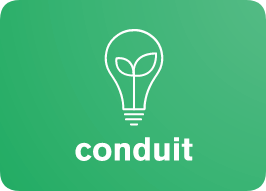
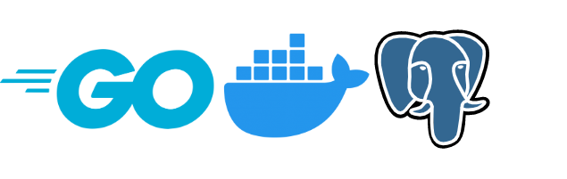

<p align="center">
  
  <h1 align="center">Conduit</h1>
  <h3 align="center">A place to share your knowledge.</h3>
</p>

<p align="center">

<a href="https://codecov.io/gh/maypok86/conduit" > 
   
</a>


<br />

## 📖 Contents

- [Technologies](#technologies)
- [Getting Started](#getting-started)
- [Contribute](#contribute)
- [License](#license)

## ⚡️ Technologies <a id="technologies" />



## 🍕 Getting Started <a id="getting-started" />

**Setting up environment variables**

Before getting started, create `.env` file following the `.env.example` file.

**Running conduit**

- Docker (recommended)

```
$ make up
```

Once you're done working, use `make down` command to stop the docker containers.

## 👏 Contribute <a id="contribute" />

Contributions are welcome as always, before submitting a new PR please make sure to open a new issue so community members can discuss it.
For more information please see [contribution guidelines](./CONTRIBUTING.md).

Additionally, you might find existing open issues which can help with improvements.

This project follows a standard [code of conduct](./CODE_OF_CONDUCT.md) so that you can understand what actions will and will not be tolerated.

## 📄 License <a id="license" />

This project is MIT licensed, as found in the [LICENSE](./LICENSE).
